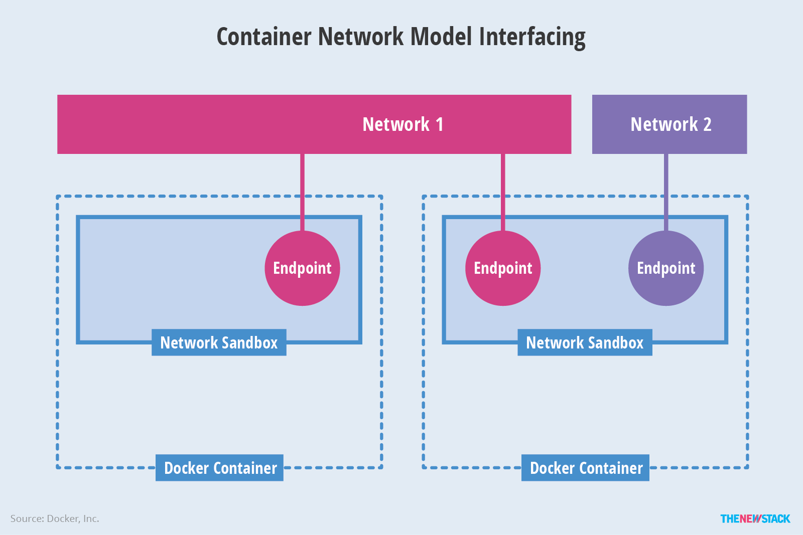

# Container fundamentals (LFS253)

## Table of contents:
- **[Virtualization fundamentals](#virtualization-fundamentals)**
- **[Virtualization mechanisms](#virtualization-mechanisms)**
- **[Container standards and runtimes](#container-standards-and-runtimes)**
- **[Image operations](#image-operations)**
- **[Container operations](#container-operations)**
- **[Building container images](#building-container-images)**
- **[Container networking](#container-networking)**
- **[Container storage](#container-storage)**
- **[Runtime and containers security](#runtime-and-containers-security)**

## Virtualization fundamentals

* Control groups (cgroups) - feature of the Linux kernel allowing the limitation, accounting, and isolation of resources used by groups of processes and the subgroup. Containers benefit from cgroups primarily because they allow system resources to be limited for processes grouped by a container. In addition, the processes of a container are treated and managed as a whole unit, and a container may be prioritized for preferential resource allocation.

```bash
#!/bin/bash

# run the following to install cgroup tooling
$ sudo apt-get update && sudo apt-get install -y cgroup-tools
# list all cgroups
$ sudo lscgroup
# list cgroup associated with a specific process
$ sudo cat  /proc/{PID}/cgroup
```

* Namespaces - are a feature of the Linux kernel allowing groups of processes have limited visibility of the host system resources. Namespaces may limit the visibility of cgroups, hostname, process IDs, IPC mechanisms, network interfaces and routes, users, and mounted file systems. To an isolated process running inside a namespace, a namespaced resource, such as the network, will appear as the process' own dedicated resource. In the context of containers, namespaces isolate processes from one container to prevent them from modifying the hostname, network interfaces, or mounts for processes running in other containers.

```bash
#!/bin/bash
# list namespaces  for a particular process
$ sudo ls -l /proc/{PID}/ns
```

* Unification File System (UnionFS) - is a feature found in Linux, FreeBSD etc., allowing the overlay of separate transparent file systems to produce an apparent single unified system.n a container, unionfs allows for changes to be made to the container image at runtime. The container image and other writable file systems are all stacked into a unionfs when the container is created and is running. The unified file system gives the impression that the actual container image is being modified. In reality, however, these changes are saved onto a real writable file system, part of the unionfs, while leaving the base container image file intact. In some environments, there is a possibility to export the new stacked files of the container into a new container image allowing users to create new and improved container images out of existing ones. All this while keeping image file sizes to a minimum as the new image file only stores the new changes with a link to the base image file.

```bash
#!/bin/bash
# run the following to install unionfs tooling
$ sudo apt-get update && sudo apt-get install -y unionfs-fuse
# create a union of a set of directory branches
$ unionfs foo/:bar/:baz/ union
# this would create a union name 'union' of the provided 3 branches
```

## Virtualization mechanisms

Virtual Machine (VM) is created on top of Hypervisor (HyperV) software that emulates hardware components (CPU, RAM etc). Typical application running in a VM requires extensive overhead to reach the physical hardware or outside worlds due to the level of abstraction. 

Container is a light-weight environment that virtualizes and isolates resources from a running application (e.g. microservice). Image, serving as a template for the container, allows application to be boxed and shipped with all its dependencies. Once deployed, container runs on the host-OS making that emulation overhead disappear.

Operating system-level virtualization - is a kernel's capability to allow the creation and existence of multiple isolated virtual environments on the same host (AKA containers, zones, partitions etc.). While this approach requires less overhead than full virtualization (because everything is managed at the kernel level), it limits the OS of the virtual environment to host OS. Also, the OS-level virtualization introduces a stacked storage management model, implemented by the file-level Copy-on-Write (CoW) mechanism. This CoW mechanism ensures minimal storage space usage when saving files that are being modified. Changes and new data are stored on disk, but data duplication is prevented by making heavy usage of links for referencing original data that remains unchanged.

* Chroot - is a mechanism implementing OS-level virtualization operating on Unix-like systems by changing the apparent root directory of a process and its children. The apparent root directory is no longer the real root directory of the OS, it’s a virtual root directory - chrooted directory. While only a root user may perform a chroot, it is not a defence mechanism against root attacks. A second chroot may be performed by a program with elevated privileges to break out of the chroot jail. In order to avoid such escapes, FreeBSD jails should be used instead, because FreeBSD can prevent a second chroot type of attack. While chroot provides partial filesystem isolation and nested virtualization, it shares some system resources such as users, I/O, network bandwidth, hostname, IP address, disk space and CPU time.

```bash
#!/bin/bash

# install Debian based guest
$ sudo apt-get install -y debianstrap
# create subdirectory for guest
$ sudo mkdir /mnt/chroot-ubuntu-xenial
# install Ubuntu Xenial suite
$ sudo debootstrap xenial /mnt/chroot-ubuntu-xenial/ http://archive.ubuntu.com/ubuntu
# open shell into installed guest OS
$ sudo chroot /mnt/chroot-ubuntu-xenial/ /bin/bash
```

* FreeBSD Jails -  is a mechanism implementing OS-level virtualization with very little overhead, allowing for the partitioning of a FreeBSD system into many independent systems - jails. They share the same kernel, but virtualize the system's files an resources for improved security and administration through clean isolation between services. Jailed processes are restricted form communicating with processes from other jails or the host, loading additional kernel modules, modifying network configurations, and performing filesystem operations to mount/unmount volumes. 

* Solaris Zones - represent securely isolated VMs on a single host system, hosting single or multiple applications/services/children. Each zone on a host system virtualizes its hostname, network, IP address, and it has assigned storage. Zones may have allocated physical resources (CPU, RAM etc.), but they required minimal storage for the configuration data. Processes running inside a zone are isolated from other zones and the rest of the host system. Direct communication is possible among processes within the same zone, however, communication with processes from other zones is only allowed through APIs. Zones may be used to run multiple applications on a single host while reducing operating costs and management complexity.
	
* OpenVZ  - allows host to run multiple isolated virtual instances (containers/virtual environments) running on the same kernel, but restricted only to Linux OS. OpenVZ containers, although virtualized systems, behave just like real physical hosts. Each container has its own virtual filesystem, users, processes, and network. By default, containers are hardware-independent because they do not have access to the real hardware of the host. However, access can be enabled by administrators to some physical devices such as disks and network cards.
	
* Linux Containers (LXC) - allows multiple isolated systems to run on a single Linux host, using chroot and cgroups, together with namespace isolation features of the Linux kernel to limit resources, set priorities, and isolate processes, the filesystem, network and users from the host operating system. LXC does not support cgroup multiple Linux hosts in namespaces for isolation.

```bash
#!/bin/bash

# intall LXC
$ sudo apt-get install -y lxc
# add current user 'dev' (non-root)  to a configuration file that allows the user to create network devices on the host
$ sudo bash -c 'echo dev veth lxcbr0 10 >> /etc/lxc/lxc-usernet'
# setup configuration file for LXC (make sure that file is not already setup by running -> 'ls -a ~/ | grep config')
$ mkdir -p ~/.config/lxc
$ cp /etc/lxc/default.conf ~/.config/lxc/default.conf
$ chmod 644 ~/.config/lxc/default.conf
# modify default.conf with UID and GID maps of the 'dev' user
$ echo lxc.idmap = u 0 $(cat /etc/subuid | cut -f 2 -d :) $(cat /etc/subuid | cut -f 3 -d :) >> ~/.config/lxc/default.conf
$ echo lxc.idmap = g 0 $(cat /etc/subgid | cut -f 2 -d :) $(cat /etc/subgid | cut -f 3 -d :) >> ~/.config/lxc/default.conf
# set access control list on ~/.local directory with the same UID value to prevent possible permission error
$ setfacl -R -m u:$(cat /etc/subuid | cut -f 2 -d :):x ~/.local
# setup unpriviledged container from the download template
$ lxc-create --template download --name unpriv-cont-user # list available templates
$ lxc-create --template download --name unpriv-cont-user --
--dist ubuntu --release xenial --arch amd64 # installs Ubuntu Xenial amd64
# start the installed container
$ lxc-start -n unpriv-cont-user -d
# list containers
$ lxc-ls -f
# show information for our container
$ lxc-info -n unpriv-cont-user
# login into out container
$ lxc-attach -n unpriv-cont-user
# stop and remove out container
$ lxc-stop -n unpriv-cont-user
$ lxc-destroy -n unpriv-cont-user
```

* Systemd-nspawn - may be used to run a simple script or boot an entire Linux-like operating system in a container. Systemd-nspawn fully isolates containers from each other and from the host system, therefore processes running in a container are not able to communicate with processes from other containers. It fully virtualizes the process tree, filesystem, users, host and domain name. Containers created by systemd-nspawn can be managed with systemd.

```bash
#!/bin/bash
# install the tool
$ sudo apt-get install -y systemd-container
# bootstrap Deian based system on the host
$ sudo debootstrap --arch=amd64 stable ~/DebianContainer 
# create container from ~/DebianContainer 
$ sudo systemd-nspawn -D ~/DebianContainer
# list container details
$ sudo machinectl list
# list container details
$ sudo machinectl show DebianContainer
# terminate container
$ sudo machinectl terminate DebianContainer
```

## Container standards and runtimes

The Open Container Initiative (OCI) - introduced in 2015 by Docker and others. `runC` is one of container runtimes implementing the OCI specification. Specifications:

* The [Runtime Specification](https://github.com/opencontainers/runtime-spec) defines how to run a "filesystem bundle" that is unpacked on disk. An OCI implementation would download and unpack an OCI image into an OCI Runtime filesystem bundle. Then, an OCI Runtime would run the OCI Runtime Bundle. 
* The [Image Specification](https://github.com/opencontainers/image-spec) helps with the development of compatible tools to ensure consistent container image conversion into containers.
* The [Distribution Specification](https://github.com/opencontainers/distribution-spec) standardized how contianer images are distributed through image registries.

The App container standard specifies the following:
- App container image
- App container pod
- App container image discovery
- App container executor

A container runtime (guided by runtime specification) describes the configuration, execution environment and the lifecycle of the container. Role of the runtime is to provide an environment supporting basic operations with images and the runnig containers that are both configurable and consistent. This allows users to develop and test containers on any system accross all tiers (from dev to prod) with the same container behaviour.
- **runC** - basic CLI tool that uses `libcontainer` runtime, provides a low-level container runtime, focused primarily on container execution. Simplicity of `runC` has its own limitation, such as (1) it does not expose an API, (2) does not provide container image management capabilities and (3) does not provide image download or integrity check capabilities. Since `runC` does not include a centralized daemon, it may be integrated with the Linux service manager - `systemd`.
- **containerd** - container runtime supporting OCI container image and runtime specifications that uses `runC` as its low-level OCI runtime. `containerd` adds image pull/push operations, network interfaces and namespaces management operation that are missing from `runC`.
- **Docker** - complex contianer development and management platforms that implements OCI specification and provides tools necessary to bundle applications into digitally signed OCI container images, to interact with container image registries, and to manage the containers lifecycle from creation to removal, and all of their dependencies in between. Docker consists of the following:
  * Docker client - CLI tool allowing users o run `docker` commands against doker daemon. Docker client and daemon communicate through REST API, UNIX sockets or a network interface. 
  * Docker daemon (`dockerd`) - responsible for building, running and distributing Docker containers. It can act alone or interact with other daemons to manage distributed Docker services across multiple Docker hosts. 
- **Podman** - daemonless container engine, allowing users to develop, manage and run OCI containers and providing REST API service that allows containers to be launched on-demand by remote applications. Podman uses `libpod` library to support pods, containers, images, and volumes. It also uses `Conmon` allowing Podman to run in detached mode while still allowing user to attach containers.
- **CRI-O** - is a minimal implementation of Container Runtime Interface (CRI) to enable the usage of any OCI compatible runtime with K8s (lightweight alternative to Docker runtime for K8s). It implements Container Network Interface (CNI) for networking and support CNI plugins, supports container security that is provided by several core Linux features such as SELinux, capabilities and seccomp.
- **Kata** - runtime aiming for a secure environment built of container-like lightweight Virtual Machines. Security is achieved through dedicated kernels that isolate the network, memory, and I/O, without sacrificing performance. Although a simple solution for an environment running containers, Kata Containers support OCI containers and integrate with the Kubernetes CRI.

## Image operations

A container image is a template for a container that includes configuration options and runtime settings to guide the container's behavior at runtime. Container image building tools may use various methods of image building that use a specific configuration file (e.g. Docker is using `Dockerfile`, while Podman may use `Containerfile` or `Dockerfile`). The storage of container image follows a layered approach meaning that any additional features will be added on top of another, while the base image data remains instact. This also avoids data duplication, where only the latest layer’s changes are being saved on the disk and the rest of the bottom level layers are just referenced, and it speeds up the image build process by caching each build step.
- `runC` runtime runs containers bundled in the OCI format, based on JSON configuration (either default or manually generated). It provides limited set of operations such as building the OCI image with all the necessary files for creation and running the container. 
- `Docker` is feature-rich and allows us to perform direct operations to manage container images as well as more complex operation to build and configure container images. `Dockerfile` is the key file containing a set of instruction that are interpreted by Docker daemon when building the image. 

## Container operations

A container is a process running on the host system, started by container runtime from a container image. The container is an isolated environment that encapsulate running application, and it runs based on configuration defined in the container image.

At runtime, virtualization features available at the kernel level are attached to the container process to help manage various aspects of the container’s virtual environment. Namespaces virtualize the container process’s PID, network, root, and users. Cgroups help set resource usage limits the container process can consume on the host system, and security contexts enforce permissions the container process has on the host system.

## Building container images

Bellow is the list of build-time instructions for Dockerfile:

- `FROM` - initializes a new build stage and defines the base image used to build our resulting image. Dockerfile must start with this instruction, but it may be preceded only by `ARG` instructions to define arguments to be used by subsequent `FROM` instructions. Multiple `FROM` instructions can be found in Dockerfile.
- `ARG` - instruction may be placed before `FROM`, or after it. When it is found before `FROM`, it is considered outside of the build stage, and its value cannot be used in any instruction after `FROM`. However, the default value of an `ARG` declared before the first `FROM` can be invoked with an `ARG` instruction followed by the `ARG` name and no value. When the `​ARG​` instruction is declared, we can pass a variable at build time.
- `RUN` - instruction is used to run commands inside the intermediate container created from the base image during the build process, and commit the results as a new image. `RUN` may be used in both shell and exec forms. In shell form the command is run by default in a shell such as /bin/sh -c in Linux or cmd /S /C in Windows. However, the shell can be modified by passing a desired shell, or with the SHELL command.
- `LABEL` - adds metadata to the resulting image as key-value pair.
- `EXPOSE` - instruction defines network ports we want to open from the container, for external entities to connect with the container on those exposed ports.
- `COPY` - instruction allows content to be copied from our build context to the intermediate container which would get committed to create the resulting image.
- `ADD` - similar to `COPY`, but it provides more features, such as accepting a URL for source, and accepting a tar file as source which is extracted at destination.
- `WORKDIR` - instruction sets the working directory for any `RUN`​, `CMD`, `ENTRYPOINT`, `COPY` and `ADD` instructions that follow it in the Dockerfile.
- `ENV` - instruction sets the environment variables inside the container.
- `VOLUME` - instruction is used to create mount point and mount external storage.
- `USER` - instruction sets the user name or UID of the resulting image for any subsequent ​RUN​, ​CMD and ENTRYPOINT​ instructions that follow it in the Dockerfile.
- `ONBUILD` - defines instructions to be executed at a later time, when the resulting image from the current build process becomes the base image of any other build.
```Dockerfile
ONBUILD <INSTRUCTION>

ONBUILD RUN pip install docker --upgrade

# For example, let's take the image created from the ​ Dockerfile​ which has the instruction lfstudent/python:onbuild​ . This image becomes the base image in ​ Dockerfile​ , like the following:
FROM lfstudent/python:onbuild

#...
# Then, while creating the image, we would see this message:
# Step 1 : FROM lfstudent/python:onbuild
# Executing 1 build trigger...
# Step 1 : RUN pip install docker --upgrade
# ---> Running in c5503d7c1475
...
```
- `STOPSIGNAL` - instruction allows us to set a system call signal that will be sent to a container to exit, such as 9, SIGNAME, or SIGKILL.
- `HEALTHCHECK` - tt times, while our container is running, the application inside may have crashed. Ideally, a container with such behavior should be stopped. To prevent a container from reaching that state, application readiness and liveliness are defined with the `HEALTHCHECK​` instruction.
- `SHELL` - define a new default shell for commands that run in Shell form​, if the defaults are not desired (default in Linux is ​ /bin/sh -c, while in Windows is ​ cmd /S /C​. With the​ SHELL​ instruction we may change the default shell used to run commands in shell form.

Bellow is the list of run-time instructions for Dockerfile:

- `CMD` - instruction executed when the container is started from the resulting image. There can only be one `CMD​` instruction in a Dockerfile​. If there are more than one `CMD​` instructions, then only the last one would take effect. The `CMD​` instruction provides defaults to the container, which get executed from the resulting image. `CMD` is used in three forms:
  - Shell form: `CMD` command param1 param2
  - Exec form (preferred): `CMD` ["executable","param1","param2"]
  - As default parameters to ENTRYPOINT - `CMD` ["param1","param2"]
- `ENTRYPOINT` - similar to `CMD​`, `ENTRYPOINT​` is also a runtime instruction. But the executable/command provided during the build time cannot be overridden at runtime. Although we can change the arguments to it, whatever is passed after the executable/command, is considered an argument to the executable/command. There can only be one `ENTRYPOINT​` instruction. It is used in two forms:
  - Shell form: `ENTRYPOINT` command param1 param2
  - Exec form: `ENTRYPOINT` ["executable", "param1", "param2"]

  `CMD​` can be used in conjunction with `ENTRYPOINT​`, but in that case, `CMD​` provides the default arguments to `ENTRYPOINT`.

## Container networking

### Container Network Model (CNM)


Libnetwork is the canonical implementation of the CNM specification. Libnetwork provides an interface between the Docker daemon and network drivers. The network controller is responsible for pairing a driver to a network. Each driver is responsible for managing the network it owns, including services provided to that network like IPAM. With one driver per network, multiple drivers can be used concurrently with containers connected to multiple networks. Drivers are defined as being either native (built-in to libnetwork or Docker supported) or remote (third party plugins). The native drivers are none, bridge, overlay and MACvlan. Remote drivers may bring any number of capabilities. Drivers are also defined as having a local scope (single host) or global scope (multi-host).



- **Network Sandbox**: Essentially the networking stack within a container, it is an isolated environment to contain a container’s network configuration.
- **Endpoint**: A network interface that typically comes in pairs. One end of the pair sits in the network sandbox, while the other sits in a designated network. Endpoints join exactly one network, and multiple endpoints can exist within a single network sandbox.
- **Network**: A group of endpoints. A network is a uniquely identifiable group of endpoints that can communicate with each other.

CNM provides an ability to sepcify user-defined metadata as **options** and **labels** that are passed between libnetwork and drivers. Labels are powerlful in that the runtime may instruct driver behavior.

### Container Network Interface (CNI)


CNI was created as a minimal specification, built alongside a number of network vendor engineers to be a simple contract between the container runtime and network plugins. A JSON schema defines the expected input and output from CNI network plugins.

Multiple plugins may be run at one time with a container joining networks driven by different plugins. Networks are described in configuration files, in JSON format, and instantiated as new namespaces when CNI plugins are invoked. CNI plugins support two commands to add and remove container network interfaces to and from networks. Add gets invoked by the container runtime when it creates a container. Delete gets invoked by the container runtime when it tears down a container instance.

CNI supported plugin groups: 
- **Main** - consists of bridge interface, ipvlan, loopback, macvlan (create a new MAC address), ptp, vlan and host-device. The main group consists of a few Windows-specific drivers such as win-bridge and win-overlay.
- **IPAM** - consists of dhcp (making DHCP requests for the container), host-local (maintains database of allocated IP addresses) and static.
- **Meta** - consists of flannel compatability, sysctl tuning, portmap (from host address space to the container), bandwidth limitation, sbr (source-based routing configuration) and firewall.

The responsibility of the plugin is to add a container to a network based on specified parameters such as the container ID and network configuration options, to delete the container form the network, and to check the status of a container's networking. 

### Differences between CNM and CNI

| CNM   | CNI   |
| ------|-------|
| Does not provide network drivers access to the container's network namespace | Provides drivers with access to the container network namespace |
| Support only Docker runtime engine only | Supports integration with third party IPAM and can be used with any container runtime |

### Docker networking drivers

- **Bridge**: The default network type that Docker containers attach to is the bridge network, implemented by the bridge driver. The main roles of a bridge network are to isolate the container network from the host system network, and to act as a DHCP server and assign unique IP addresses to containers as they are running attached to the bridge. This is a useful feature when containers of an application need to talk to each other while they all run on the same host system. Other features of bridge networks depend whether the bridge is default or user-defined. Most often, a user-defined bridge presents advantages over the default bridge, such as better traffic isolation, automatic DNS resolution, on-the-fly container connection/disconnection to and from the network, advanced and flexible configuration options, and even sharing of environment variables between containers.
- **Host**: The host network driver option, as opposed to the bridge, eliminates the network isolation between the container and the host system by allowing the container to directly access the host network. In addition, it may help with performance optimization by eliminating the need for Network Address Translation (NAT) or proxying since the container ports are automatically published and available as host ports.
- **Overlay**: It is the network type that spans multiple hosts, typically part of a cluster, allowing the containers' traffic to be routed between hosts as containers or services from one host attempt to talk to others running on another host in the cluster.
- **Macvlan**: The macvlan network driver allows a user to change the appearance of a container on the physical network. A container may appear as a physical device with its own MAC address on the network, thus enabling the container to be directly connected to the physical network instead of having its traffic routed through the host network.
- **None**: The none driver option for container networking disables the networking of a container while allowing the very same container to use a custom third-party network driver, if needed, to implement its networking requirements.

### Docker Network Modes

- **Internal Mode**: This mode isolates overlay network in order to restrict containers access to the outside world.
- **Ingress Mode**: This mode targets the networking of swarms and implements routing-mesh accross the host of the swarm cluster. A single ingress can be defined and it cannot be removed for as long as services are using it.

## Container storage

The [Copy-on-Write (CoW strategy)](https://docs.docker.com/storage/storagedriver/#the-copy-on-write-cow-strategy) is a strategy of sharing and copying files for maximum efficiency. In UnionFS CoW allows users to "indirectly" modify the content of files available to the running container from the base container image storage layer. While the container image files are Read-Only, when a user attempts to modify such a file, no errors or mechanisms will prevent the user from doing so. Instead, the base container image file is copied and saved on the ephemeral storage layer of the container and the user is allowed to make changes to the new copy of the file. In essence, a copy of a file is being saved when a user attempts to edit a Read-Only file of the base container image, all while the base container image file remains intact.

**Ephemeral data** is a volatile data needed for a very short period of time that does not bring any harm to the business when lost. Data stored on ephemeral storage is defined within the scope of the container and is purged when container is terminated. 

**Persistent data** is a critical data that has to be stored in a location that provides data resilience. It's recommended that this type of data is stored on external peristent volume mounts managed from the Docker CLI for easy backup and migration, portability, and extended functionality. Persistent volumes are not managed by UnionFS, aren't defined in the scope of the container, and don't get deleted together with the container.

## Runtime and containers security

### Securing the environment
Before we actually dive into runtime and container security it's worth mentioning that security begins by securing the running environment first: OS, network, storage etc.

### Securing the Container Runtime
Running container processes inherit their permissions from the user who is running the container engine, thus it's recommended that containers are run with non-root users. 

### Securing the Client Access
Client security is another pain point, however, Docker allows users to secure access to the Docker daemon socket through multiple methods. A popular method is via SSH, while a more complex method is via TLS over HTTPS. Docker client requests can be secured by default ensuring that every call is verified. Daemon and Client modes also allow for client authentication mechanism configuration, in addition to a secure Docker port configuration option.

### Running Secure Container Images
Ensuring that we deploy containers from trusted images is another important security aspect. Luckily, Docker provides signature verification that ensures only signed images are run as containers by the runtime.

### Secure Containers
Despite the debate happening over rooted vs non-rooted mode, there is a solution the removes that security risk. **capabilities** is a complex method that removes the need for root access of a container process with a controlled and limited root access that can be managed and set at a very granular level. The benefit of capabilities is that the container process will only receive the needed amount of privileges over the resources of the host that are critical for the container’s operations. All other resources will be accessed as a regular user with unprivileged restricted permissions.

### Security Tools
Container processes may be secured by assigning AppArmor profiles to them that restrict specific usage of the tools.

Another layer of container process security can be protected with Seccomp. Secure computing is a Linux kernel feature designed to restrict the access of a container process over host resources. Seccomp profiles can allow or block system calls that may modify kernel modules, kernel memory, kernel I/O, modify namespaces, etc. Both Seccomp and capabilities are equally complex and granular approaches, and a significant amount of functional overlap can be observed.
