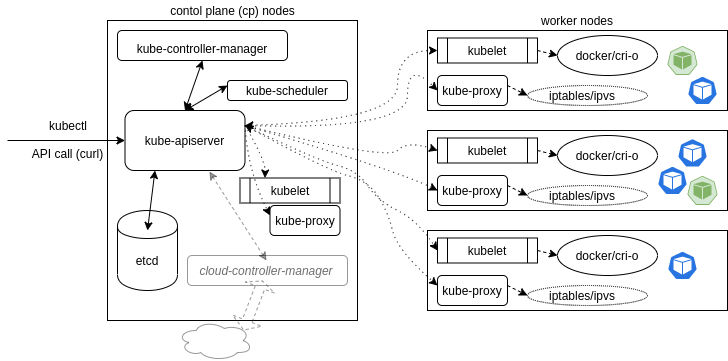
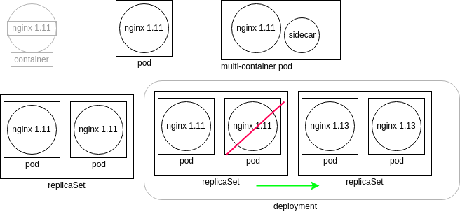

# Kubernetes fundamentals (LFS258)

---

## Table of contents:

- **[Basics of K8s](#basics-of-k8s)**
- **[Simple Pod](#simple-pod)**
- **[APIs and Access](#apis-and-access)**
- **[Managing state with deployment](#managing-state-with-deployment)**
- **[Volumes and Data](#volumes-and-data)**
- **[Services](#services)**
- **[Helm](#helm)**
- **[Ingress](#ingress)**
- **[Scheduling](#scheduling)**
- **[Logging and Troubleshooting](#logging-and-troubleshooting)**
- **[Custom Resource Definition](#custom-resource-definition)**
- **[Security](#security)**

For information on how to configure your machine to follow along this guide please see the [Installation Guide](installation_guide.md).

## Basics of K8s

---

### Architecture

K8s consists of control plane (CP) and worker nodes, where CP runs an API service, scheduler, controllers, storage system to keep the state of the cluster, container settings, and networking configurations.
- `kubelet` - systemd process running on each node that accepts the API calls for Pod specification (aka. `PodSpec`) and will work to configure the local node until the specification has been met.
- `kube-apiserver` - API server serving REST operation and provides the frontend to the cluster's shared state through which all other components interact. API server validates and configures data for the API object which include pods, services, replication controllers etc.
- `kube-scheduler` - CP process that assigns pods to nodes determining which nodes are valid placements for each pod in the scheduling queue according to constraints and available resources. 
- `kube-proxy` - process running on every node, creates and manages networking rules to expose the container on the network to other containers or the outside world.
- `kube-controller-manager` - daemon control loop that watches the shared state of the cluster through the API server and makes changes attempting to move current state towards the desired state, e.g. replication controller, endpoint controller etc.
- `etcd` - database that stores the state of the cluster, and other persistent information in a b+tree key-value store. Instead of finding and changing an entry, values are always appended to the end and previous copies of the data are then marked for future removal by a compaction process.
- K8s provides a DNS pod and service that can be used to resolve DNS request to resolve pod and service names (DNS records are only created for Pods and Services).   



### Terminology

- **Namespaces** - a mechanism for isolating groups of resources within a single cluster. Names of resources need to be unique withing the namespace, but not across namespaces.
- **Label** - key:value pair used to organize and select groups of objects. Useful for filtering.
- **Annotations** - metadata that is not used by selector, but instead can be used by 3rd application or tools.
- **Node** - physical or virtual machine that serves as a worker in K8s. Each node is managed by CP and containers the services necessary to run pods.
- **Taints** - node configuration that allows to refuse pod assignments.
- **Toleration** - is a pod metadata that allows scheduler to schedule pods with matching taints.
- **Controllers**  - are watch-loops that monitor and modify the state of the cluster by interacting with the API server. Controllers are compiled into `kube-controller-manager`, however, other controllers may be added using custom resource definition.
  - _Informer_ - uses API server as a source to request the state of an object via an API call (received data is cached).
  - _SharedInformer_ - identical to _Informer_, with one difference - created cache is shared for multiple requests.
  - _Workqueue_ - uses a key to hand out tasks to various workers. The standard Go work queues of rate limiting, delayed, and time queue are typically used.
- **Workloads:**
  - **Pods** - are the smallest deployable units of computing that can be created and managed in K8s. Pod consists of one or more containers, with shared storage and network resources, and a specification for how to run the containers. Contents of the pod are always co-located and co-scheduled, and run in a shared context.
  - **Workload resources:**
      - **Deployments** - provides declarative updates for pods and replicaSets (serves as an abstraction over pods). Deployment controller changes the actual state to the specified desired state at a controlled rate.
      - **ReplicaSet** - maintains stable set of replica pods running at any given time. It's often used to guarantee the availability of a specified number of identical pods.
      - **StatefulSet** - similar to deployment it manages pods based on their spec, however, it maintains a sticky identity for each pod. StatefulSet provides guarantees about the ordering and uniqueness of the pods. (e.g. database deployment will be managed by statefulSets that would eliminate data inconsistencies)
      - **DaemonSet** - ensures that all (or some) nodes run a copy of a pod. Pods are added or garbage collected if node is added or removed from the cluster.
      - **ReplicationController** - ensure that a specific number of pods is running at any one time, providing ability to do rolling updates. 
- **Services, Load balancing and networking:**
  - **Service** - abstraction that defines a logical set of pods and a policy by which to access them. It has two main functionalities (1) permanent IP address (static) that can be used instead of pod IP address, (2) load balancer. Because lifecycle of pod and service is not connected, if a pod dies, service will still remain active.
  - **Ingress** - an API object that manages external access to the services in a cluster (forwards external requests to internal services).
- **Storage:**
  - **Volumes** - abstraction serving as a data persistence for pods that attaches storage on local machine or outside the cluster.
- **Configuration:**
  - **ConfigMap** - non-confidential key-value pair configuration that is consumed by pods via env. variables, CLI arguments or configuration file in volume.
  - **Secrets** - similar to ConfigMap, however, they are specifically designed to hold sensitive data, such as passwords, tokens or keys.

### Components


### Single IP per Pod


The graphic shows a pod with two containers, A and B, and two data volumes, 1 and 2. Containers A and B share the network namespace of a third container, known as the pause container. The pause container is used to get an IP address, then all the containers in the pod will use its network namespace. To communicate with each other, containers within pods can use the loopback interface, write to files on a common filesystem, or via inter-process communication (IPC).

### Container to Outside Path


Even though there are two containers, they share the same namespace and the same IP address, which would be configured by kubectl working with kube-proxy. The IP address is assigned before the containers are started, and will be inserted into the containers. The container will have an interface like eth0@tun10. This IP is set for the life of the pod.

The endpoint is created at the same time as the service. Note that it uses the pod IP address, but also includes a port. The service connects network traffic from a node high-number port to the endpoint using iptables with ipvs on the way. The kube-controller-manager handles the watch loops to monitor the need for endpoints and services, as well as any updates or deletions.

## Simple Pod

---

The bellow YAML file contains specifications for simple pod that will be deployed in your K8s cluster. Create a new file `simple-pod.yaml` and copy the content bellow.
```yaml
apiVersion: v1
kind: Pod
metadata:
    name: firstpod
spec:
    containers:
    - image: nginx
      name: stan 
```

Run the following commands:
```bash
# create a new pod
$> kubectl create -f simple-pod.yaml 
# check that pod was created 
$> kubectl get pods
# get pod object as YAML output
$> kubectl get pod simple-pod -o yaml
# delete our pod
$> kubectl delete pod simple-pod
```

## APIs and Access 

---

Kunernetes entire architecture is build with powerful REST-based APIs, e.g. `kubectl` make API calls on your behalf (`kubectl` can be replaced with standard cURL or 3rd party program to interact with K8s).

### Access checking

The following `kubectl` command can be used to query current authorization for administrator or another user:
```bash
# check authorizations for current user
$> kubectl auth can-i create deployments
# check authorizations for another user in a namespace
$> kubectl auth can-i create deployments --as foo --namespace bar
```

There are currently three APIs which can be applied to set who and what can be queried:
- **SelfSubjectAccessReview** - Access review for any user, helpful for delegating to others. 
- **LocalSubjectAccessReview** - Review is restricted to a specific namespace.
- **SelfSubjectRulesReview** - A review which shows allowed actions for a user within a particular namespace. 

**Note:** The use of reconcile allows a check of authorization necessary to create an object from a file. No output indicates the creation would be allowed.

### Namespaces

- `default` - namespace for keeping all resources, unless specified otherwise.
- `kube-node-lease` - namespace for keeping worker node lease information.
- `kube-public` - namespace that is available for everybody (including unauthenticated users), containing general information.
- `kube-system` - namespace containing infrastructural pods.

**Note:** If you would like to see all resource on the system you can run the following `kubectl get --all-namespaces pods`

## Managing state with deployment

---



The graphic in the upper left represents a container running nginx 1.11. Kubernetes does not directly manage the container. Instead, the kubelet daemon checks the pod specifications by asking the container engine, which could be Docker or cri-o, for the current status. The graphic to the right of the container shows a pod which represents a watch loop checking the container status. kubelet compares the current pod spec against what the container engine replies and will terminate and restart the pod if necessary.

A multi-container pod is shown next. While there are several names used, such as sidecar or ambassador, these are all multi-container pods. The names are used to indicate the particular reason to have a second container in the pod, instead of denoting a new kind of pod.

On the lower left we see a replicaSet. This controller will ensure you have a certain number of pods running. The pods are all deployed with the same podSpec, which is why they are called replicas. Should a pod terminate or a new pod be found, the replicaSet will create or terminate pods until the current number of running pods matches the specifications. Any of the current pods could be terminated should the spec demand fewer pods running.

The graphic in the lower right shows a deployment. This controller allows us to manage the versions of images deployed in the pods. Should an edit be made to the deployment, a new replicaSet is created, which will deploy pods using the new podSpec. The deployment will then direct the old replicaSet to shut down pods as the new replicaSet pods become available. Once the old pods are all terminated, the deployment terminates the old replicaSet and the deployment returns to having only one replicaSet running.

## Volumes and Data

---

The below Yaml specification will create a Pod with a single container with a volume named `scratch-volume` of storage type `emptyDir`. The kubelet will create the directory in the container, but not mount any storage. Any data created is written to the shared container space. As a result, it would not be persistent storage. When the Pod is destroyed, the directory would be deleted along with the container. 
```yaml
apiVersion: v1
kind: Pod
metadata:
    name: fordpinto 
    namespace: default
spec:
    containers:
    - image: simpleapp 
      name: gastank 
      command:
        - sleep
        - "3600"
      volumeMounts:
      - mountPath: /scratch
        name: scratch-volume
    volumes:
    - name: scratch-volume
            emptyDir: {}
```

### Types

- `GCEpersistentDisk` and `awsElasticBlockStore` - are GCE and AWS specific volume types that allow you to mount GCE and EBS disks in your pods.
- `emptyDir` - is an empty directory that gets erased when pod dies.
- `hostPath` - mounts a resource from host node filesystem. Resource can be directory, file socket, or block device. The resource should already exist on the host node. There are two types, `DirecotoryOrCreate` and `FileOrCreate`, that create resource on the host and use them if they don't already exist.
- NFS (Network File System) and iSCSI (Internet Small Computer System Interface) - straightforward choices for multiple reader scenarios.

Many more volume type exist (and many more are added) that are not listed. For more information navigate to [Kubernetes official volumes documentation](https://kubernetes.io/docs/concepts/storage/volumes/)

### Persistent Volumes

Persistent volume - is a storage abstraction used to retain data longer than the pods using it. Pods define `persistentVolumeClaim` or `pvc` with various parameters for size and the type of backend storage - `StorageClass`. Cluster then attaches `persistentVolume` as a response. Persistent volume stages:
- Provisioning can be from PVs created in advance by the cluster administrator, or requested from a dynamic source, such as the cloud provider.
- Binding occurs when a control loop on the cp notices the PVC, containing an amount of storage, access request, and optionally, a particular StorageClass. The watcher locates a matching PV or waits for the StorageClass provisioner to create one. The PV must match at least the storage amount requested, but may provide more.
- The use phase begins when the bound volume is mounted for the Pod to use, which continues as long as the Pod requires.
- Releasing happens when the Pod is done with the volume and an API request is sent, deleting the PVC. The volume remains in the state from when the claim is deleted until available to a new claim. The resident data remains depending on the persistentVolumeReclaimPolicy.
- The reclaim phase has three options:
  - Retain, which keeps the data intact, allowing for an administrator to handle the storage and data. 
  - Delete tells the volume plugin to delete the API object, as well as the storage behind it.
  - The Recycle option runs a `rm -rf /mountpoint` and then makes it available to a new claim. With the stability of dynamic provisioning, the Recycle option is planned to be deprecated.

The below Yaml specification creates a basic persistent volume using the `hostPath` type.
```yaml
apiVersion: v1
kind: PersistentVolume
metadata:
    name: 10Gpv01
    labels: 
        type: local 
spec:
    capacity: 
        storage: 10Gi
    accessModes:
        - ReadWriteOnce
    hostPath:
        path: "/foo/bar"
```

**Note:** Persistent volumes aren't namespace objects, however, persistent volume claims are.

The below Yaml specification creates a basic persistent volume claim for above volume. This claim can be now specified in Pod specification.
```yaml
apiVersion: v1
kind: PersistentVolumeClaim
metadata:
    name: fooClaim
spec:
    accessModes:
        - ReadWriteOnce
    resources:
        requests:
                storage: 8GI
```

Dynamic provisioning allows cluster to request storage from an exterior, pre-configured source. API calls made by the appropriate plugin allow for a wide range of dynamic storage use. The `StorageClass` API resource allows an administrator to define a persistent volume provisioner of a certain type, passing storage-specific parameters. With a `StorageClass` created, a user can request a claim, which the API Server fills via auto-provisioning. The resource will also be reclaimed as configured by the provider.

The below Yaml specification creates `StorageClass` for GCE.
```yaml
apiVersion: storage.k8s.io/v1
kind: StorageClass
metadata:
  name: foo
provisioner: kubernetes.io/gce-pd
parameters:
  type: pd-ssd
```

Reclaim policy `persistentVolumeReclaimPolicy` defined in `PersistentVolume` determines how the storage resources can be reused when it is no longer needed:
- Retain - data will not be deleted unless manually requested
- Recycle - deletes all the data by removing its files. This can be useful to reuse a disk that is not dynamically provisioned, for example a NFS disk 
- Delete - deletes the underlying storage (only applies on cloud storage, some StorageClasses won't be able to delete the underlying disk)


When more than one namespace share some kind of resource (e.g. volume) there is always a chance that one of namespaces will use more resources than others. This is when `ResourceQuata` comes in handy. `ResourceQuota` provides constraints that limit aggregate resource consumption per namespace. It can limit the quantity of objects that can be created in a namespace by type, as well as the total amount of compute resources that may be consumed by resources in that namespace.

The below Yaml specification will create a `ResourceQuota` on persistent volume claim.
```yaml
apiVersion: v1
kind: ResourceQuota
metadata:
  name: storagequota
spec:
  hard:
    persistentvolumeclaims: "10"
    requests.storage: "500Mi"
```

## Services

---

### Types

- `ClusterIP` - is the default, and only provides access internally (except if manually creating an external endpoint). The range of ClusterIP used is defined via an API server startup option.
- `NodePort` - is great for debugging, or when a static IP address is necessary, such as opening a particular address through a firewall. The NodePort range is defined in the cluster configuration.
- `LoadBalancer` - was created to pass requests to a cloud provider like GKE or AWS. Private cloud solutions also may implement this service type if there is a cloud provider plugin, such as with CloudStack and OpenStack. Even without a cloud provider, the address is made available to public traffic, and packets are spread among the Pods in the deployment automatically.
- `ExternalName` - has no selectors, nor does it define ports or endpoints. It allows the return of an alias to an external service. The redirection happens at the DNS level, not via a proxy or forward. This object can be useful for services not yet brought into the Kubernetes cluster. A simple change of the type in the future would redirect traffic to the internal objects.

The controllers of services and endpoints run inside the `kube-controller-manager` and send API calls to the `kube-apiserver`. API calls are then sent to the network plugin, such as `calico-kube-controller`, which then communicates with agents on each node, such as `calico-node`. Every `kube-proxy` is also sent an API call so that it can manage the firewall locally. The firewall is often iptables or ipvs. The `kube-proxy` mode is configured via a flag sent during initialization, such as `mode=iptables`, and could also be IPVS or userspace.


### Overall Network View

An example of a multi-container pod with two services sending traffic to its ephemeral IP can be seen in the diagram below. The diagram also shows an ingress controller, which would typically be represented as a pod, but has a different shape to show that it is listening to a high numbered port of an interface and is sending traffic to a service. Typically, the service the ingress controller sends traffic to would be a ClusterIP, but the diagram shows that it would be possible to send traffic to a NodePort or a LoadBalancer.

This graphic shows a pod with a primary container, App, with an optional sidecar Logger. Also seen is the pause container, which is used by the cluster to reserve the IP address in the namespace prior to starting the other pods. This container is not seen from within Kubernetes, but can be seen using docker and `crictl`.


### DNS

The use of `CoreDNS` allows for a great amount of flexibility. Once the container starts, it will run a Server for the zones it has been configured to serve. Then, each server can load one or more plugin chains to provide other functionality. As with other microservices, clients would it access using a service, `kube-dns`.

## Helm

---

Helm helps to manage Kubernetes application via Helm charts that are used to define, install and upgrade even the most complex application.

A typical containerized application will have several manifests. Manifests for deployments, services, and configMaps. You will probably also create some secrets, Ingress, and other objects. Each of these will need a manifest. With Helm, you can package all those manifests and make them available as a single tarball. You can put the tarball in a repository, search that repository, discover an application, and then, with a single command, deploy and start the entire application, one or more times.

### Structure

The below directory structure is the most typical setup for simple application (in this example MariaDB).

```
├── Chart.yaml
├── README.md
├── templates
|   ├── NOTES.txt
|   ├── _helpers.tpl
|   ├── configmap.yaml
|   ├── deployment.yaml
|   ├── pvc.yaml
|   ├── secrets.yaml
|   └── svc.yaml
└── values.yaml
```

- The `Chart.yaml` file contains some metadata about the Chart, like its name, version, keywords, and so on, in this case, for MariaDB.
- The `values.yaml` file contains keys and values that are used to generate the release in your cluster. These values are replaced in the resource manifests using the Go templating syntax.
- The `templates` directory contains the resource manifests that make up this MariaDB application.

### Templates

The below Yaml specification uses Go templating syntax to insert value form `values.yaml` to create `Secret` object.

```yaml
apiVersion: v1
kind: Secret
metadata:
    name: {{ template "fullname" . }}
    labels:
        app: {{ template "fullname" . }}
        chart: "{{ .Chart.Name }}-{{ .Chart.Version }}"
        release: "{{ .Release.Name }}"
        heritage: "{{ .Release.Service }}"
type: Opaque
data:
    mariadb-root-password: {{ default "" .Values.mariadbRootPassword | b64enc | quote }}
    mariadb-password: {{ default "" .Values.mariadbPassword | b64enc | quote }}
```

For more information on Helm see [this module notebook](../helm/notebook.md).

## Ingress 

---

Ingress exposes HTTP and HTTPS routes from outside the cluster to services within the cluster. Traffic routing is controlled by rules defined on the Ingress resource.

Below is a simple example where an Ingress sends all its traffic to one Service.


An Ingress may be configured to give Services externally-reachable URLs, load balance traffic, terminate SSL/TLS, and offer name-based virtual hosting. An Ingress controller is responsible for fulfilling the Ingress, usually with a load balancer, though it may also configure your edge router or additional frontends to help handle the traffic.

An Ingress does not expose arbitrary ports or protocols. Exposing services other than HTTP and HTTPS to the internet typically uses a service of type `Service.Type=NodePort` or `Service.Type=LoadBalancer`.

The below Yaml specification creates a typical Ingress object.
```yaml
apiVersion: networking.k8s.io/v1beta1 
kind: Ingress 
metadata:
name: ghost
spec:
rules:
  - host: ghost.192.168.99.100.nip.io
    http:
      paths:
      - backend:
          service
            name: ghost
            port:
              number: 2368 
        path: /
        pathType: ImplementationSpecific
```

### Ingress Controller

An Ingress Controller is a daemon running in a Pod which watches the `/ingresses` endpoint on the API server, which is found under the `networking.k8s.io/v1beta1` group for new objects. When a new endpoint is created, the daemon uses the configured set of rules to allow inbound connection to a service, most often HTTP traffic. This allows easy access to a service through an edge router to Pods, regardless of where the Pod is deployed.

Multiple Ingress Controllers can be deployed. Traffic should use annotations to select the proper controller. The lack of a matching annotation will cause every controller to attempt to satisfy the ingress traffic.

### Proxies

For more complex connections or resources such as service discovery, rate limiting, traffic management and advanced metrics, you may want to implement a service mesh.

A service mesh consists of edge and embedded proxies communicating with each other and handling traffic based on rules from a control plane. Various options are available, including `Envoy`, `Istio`, and `linkerd`.


- `Envoy` - is a modular and extensible proxy favored due to its modular construction, open architecture and dedication to remaining unmonetized. It is often used as a data plane under other tools of a service mesh.
- `Istio` - is a powerful tool set which leverages Envoy proxies via a multi-component control plane. It is built to be platform-independent, and it can be used to make the service mesh flexible and feature-filled.
- `linkerd` is another service mesh, purposely built to be easy to deploy, fast, and ultralight.

For more information on Service Mesh see [this module notebook](../service-mesh-fundamentals/notebook.md).

## Scheduling

---

A scheduler watches for newly created Pods that have no Node assigned. For every Pod that the scheduler discovers, the scheduler becomes responsible for finding the best Node for that Pod to run on. The scheduler reaches this placement decision taking into account the scheduling principles described below.

The `kube-scheduler` determines which nodes will run a Pod, using a topology-aware algorithm. Users can set the priority of a pod, which will allow preemption of lower priority pods. The eviction of lower priority pods would then allow the higher priority pod to be scheduled. The scheduler tracks the set of nodes in your cluster, filters them based on a set of predicates, then uses priority functions to score or determine on which node each Pod should be scheduled. The Pod specification as part of a request is sent to the kubelet on the node for creation.

The `kube-scheduler` selects a node for the pod in 2-step operation:
1. Filtering (Predicates) - The filtering step finds the set of Nodes where it's feasible to schedule the Pod. For example, the `PodFitsResources` filter checks whether a candidate Node has enough available resource to meet a Pod's specific resource requests. After this step, the node list contains any suitable Nodes; often, there will be more than one. If the list is empty, that Pod isn't (yet) schedulable.
2. Scoring (Priorities) - In the scoring step, the scheduler ranks the remaining nodes to choose the most suitable Pod placement. The scheduler assigns a score to each Node that survived filtering, basing this score on the active scoring rules.

Finally, `kube-scheduler` assigns the Pod to the Node with the highest ranking. If there is more than one node with equal scores, `kube-scheduler` selects one of these at random.

There are two supported ways to configure the filtering and scoring behavior of the scheduler:
1. Scheduling Policies allow you to configure Predicates for filtering and Priorities for scoring. 
2. Scheduling Profiles allow you to configure Plugins that implement different scheduling stages, including: `QueueSort`, `Filter`, `Score`, `Bind`, `Reserve`, `Permit`, and others. You can also configure the kube-scheduler to run different profiles

**Note:** That custom scheduler can be deployed, if default scheduler does not meet your business requirements.

### Pod Affinity Rules

Pods which may communicate a lot or share data may operate best if co-located, which would be a form of affinity. For greater fault tolerance, you may want Pods to be as separate as possible, which would be anti-affinity. These settings are used by the scheduler based on the labels of Pods that are already running. As a result, the scheduler must interrogate each node and track the labels of running Pods. Clusters larger than several hundred nodes may see significant performance loss. Pod affinity rules use `In`, `NotIn`, `Exists`, and `DoesNotExist` operators.
- `requiredDuringSchedulingIgnoredDuringExecution` - means that the Pod will not be scheduled on a node unless the following operator is true. If the operator changes to become false in the future, the Pod will continue to run. This could be seen as a hard rule.
- `preferredDuringSchedulingIgnoredDuringExecution` - will choose a node with the desired setting before those without. If no properly-labeled nodes are available, the Pod will execute anyway. This is more of a soft setting, which declares a preference instead of a requirement.
- `podAffinity` - the scheduler will try to schedule Pods together.
- `podAntiAffinity` - would cause the scheduler to keep Pods on different nodes.

### Taints

A node with a particular taint will repel Pods without tolerations for that taint. A taint is expressed as `key=value:effect`. The key and the value are created by the administrator.

Ways to schedule a pod:
- `NoSchedule` - the scheduler will not schedule a Pod on this node, unless the Pod has this toleration. Existing Pods continue to run, regardless of toleration.
- `PreferNoSchedule` - the scheduler will avoid using this node, unless there are no untainted nodes for the Pods toleration. Existing Pods are unaffected.
- `NoExecute` - this taint will cause existing Pods to be evacuated and no future Pods scheduled. Should an existing Pod have a toleration, it will continue to run. If the Pod `tolerationSeconds` is set, they will remain for that many seconds, then be evicted. Certain node issues will cause the kubelet to add 300 second tolerations to avoid unnecessary evictions.

### Tolerations

Setting tolerations on a node are used to schedule Pods on tainted nodes. This provides an easy way to avoid Pods using the node. Only those with a particular toleration would be scheduled.

An operator can be included in a Pod specification, defaulting to `Equal` if not declared. The use of the operator `Equal` requires a value to match. The `Exists` operator should not be specified. If an empty key uses the `Exists` operator, it will tolerate every taint. If there is no effect, but a key and operator are declared, all effects are matched with the declared key.

## Logging and Troubleshooting

---

### Basics

The troubleshooting flow should start with the obvious. If there are errors from the command line, investigate them first. The symptoms of the issue will probably determine the next step to check. Working from the application running inside a container to the cluster as a whole may be a good idea. The application may have a shell you can use. For example, see the following commands: 

```bash
# create and deploy busybox container
$> kubectl create deploy busybox --image=busybox --command sleep 3600
# login into container
$> kubectl exec -ti <busybox_pod> -- /bin/sh
```

If the Pod is running, use kubectl logs pod-name to view the standard out of the container. Without logs, you may consider deploying a sidecar container in the Pod to generate and handle logging. The next place to check is networking, including DNS, firewalls and general connectivity, using standard Linux commands and tools.

Security settings can also be a challenge. RBAC, covered in the security chapter, provides mandatory or discretionary access control in a granular manner. SELinux and AppArmor are also common issues, especially with network-centric applications.

### Cluster start sequence

The cluster startup sequence begins with systemd if you built the cluster using `kubeadm`. Other tools may leverage a different method. Use systemctl status `kubelet.service` to see the current state and configuration files used to run the kubelet binary.
- Uses `/etc/systemd/system/kubelet.service.d/10-kubeadm.conf` file

Inside the `config.yaml` file you will find several settings for the binary, including the `staticPodPath` which indicates the directory where kubelet will read every yaml file and start every pod. If you put a yaml file in this directory, it is a way to troubleshoot the scheduler, as the pod is created with any requests to the scheduler.
- Uses `/var/lib/kubelet/config.yaml` configuration file.
- `staticPodPath` is set to `/etc/kubernetes/manifests/`.

The four default yaml files will start the base pods necessary to run the cluster:
- kubelet creates all pods from `*.yaml` in directory: `kube-apiserver`, `etcd`, `kube-controller-manager`, `kube-scheduler`.

Once the watch loops and controllers from `kube-controller-manager` run using etcd data, the rest of the configured objects will be created.

### Plugins

Kubernetes allows you to install necessary plugins for `kubectl` command with `krew`. Installed plugins can then be run as a sub-command for `kubectl`.

```bash
$> export PATH="${KREW_ROOT:-$HOME/.krew}/bin:$PATH"
# list available plugins
$> kubectl krew search
# install a plugin
$> kubectl krew install sniff
```

### Network Sniffing

Cluster network traffic is encrypted making troubleshooting of possible network issues more complex. Using the sniff plugin you can view the traffic from within. `sniff` requires Wireshark and ability to export graphical display.

The `sniff` command will use the first found container unless you pass the `-c` option to declare which container in the pod to use for traffic monitoring.

```bash
$> kubectl krew install sniff nginx-123456-abcd -c webcont
```

## Custom Resource Definition

---

A custom resource is an extension of the Kubernetes API that is not necessarily available in a default Kubernetes installation. It represents a customization of a particular Kubernetes installation. However, many core Kubernetes functions are now built using custom resources, making Kubernetes more modular.

Custom resources can appear and disappear in a running cluster through dynamic registration, and cluster admins can update custom resources independently of the cluster itself. Once a custom resource is installed, users can create and access its objects using `kubectl`, just as they do for built-in resources like Pods.

The below Yaml specification creates a CRD for custom backup.
```yaml
apiVersion: apiextensions.k8s.io/v1
kind: CustomResourceDefinition
metadata:
  name: backups.stable.linux.com
spec:
  group: stable.linux.com
  version: v1
  scope: Namespaced
  names:
    plural: backups
    singular: backup
    shortNames:
    - bks
    kind: BackUp
```

The below Yaml specification creates an object based on the above CRD.
```yaml
apiVersion: "stable.linux.com/v1"
kind: BackUp
metadata:
  name: a-backup-object
spec:
  timeSpec: "* * * * */5"
  image: linux-backup-image
replicas: 5
```

### Aggregation Layer

The aggregation layer allows Kubernetes to be extended with additional APIs, beyond what is offered by the core Kubernetes APIs. The additional APIs can either be ready-made solutions such as a metrics server, or APIs that you develop yourself.

The aggregation layer is different from Custom Resources, which are a way to make the `kube-apiserver `recognise new kinds of object.

The aggregation layer runs in-process with the `kube-apiserver`. Until an extension resource is registered, the aggregation layer will do nothing. To register an API, you add an APIService object, which `claims` the URL path in the Kubernetes API. At that point, the aggregation layer will proxy anything sent to that API path (e.g. `/apis/myextension.mycompany.io/v1/…`) to the registered APIService.

The most common way to implement the APIService is to run an extension API server in Pod(s) that run in your cluster. If you're using the extension API server to manage resources in your cluster, the extension API server (also written as `extension-apiserver`) is typically paired with one or more controllers. The `apiserver-builder` library provides a skeleton for both extension API servers and the associated controller(s).

## Security

---

For more information on Kubernetes Security see [this module notebook](../k8s-security/notebook.md).

To perform any action in a Kubernetes cluster, you need to access the API and go through three main steps:
- Authentication (token)
- Authorization (RBAC)
- Admission Controllers


Once a request reaches the API server securely, it will first go through any authentication module that has been configured. The request can be rejected if authentication fails, or it gets authenticated and passed to the authorization step.

At the authorization step, the request will be checked against existing policies. It will be authorized if the user has the permissions to perform the requested actions. Then, the requests will go through the last step of admission. In general, admission controllers will check the actual content of the objects being created and validate them before admitting the request.

### Authentication

Main point of Kubernetes authentication:
- In its straightforward form, authentication is done with certificates, tokens or basic authentication (i.e. username and password).
- Users are not created by the API, but should be managed by an external system.
- System accounts are used by processes to access the API.

There are two more advanced authentication mechanisms. Webhooks can be used to verify bearer tokens, and connection with an external OpenID provider.

The type of authentication used is defined in the `kube-apiserver` startup options. Below are four examples of a subset of configuration options that would need to be set depending on what choice of authentication mechanism you choose:
```
--basic-auth-file
--oidc-issuer-url
--token-auth-file
--authorization-webhook-config-file
```

### Authorization

There are two main authorization modes and two global Deny/Allow settings. The main modes are:
- Role based access control (RBAC)
- Webhook

They can be configured as `kube-apiserver` startup options:
```
--authorization-mode=RBAC
--authorization-mode=Webhook
--authorization-mode=AlwaysDeny
--authorization-mode=AlwaysAllow
```

#### RBAC

All resources are modeled API objects in Kubernetes, from Pods to Namespaces. They also belong to API Groups, such as `core` and `apps`.These resources allow operations such as Create, Read, Update, and Delete (CRUD), which we have been working with so far. Operations are called `verbs` inside YAML files. Adding to these basic components, we will add more elements of the API, which can then be managed via RBAC.

Rules are operations which can act upon an API group. Roles are a group of rules which affect, or scope, a single namespace, whereas `ClusterRoles` have a scope of the entire cluster.

Each operation can act upon one of three subjects, which are `User Accounts` which don't exist as API objects, `Service Accounts`, and `Groups` which are known as `clusterrolebinding` when using kubectl.

RBAC is then writing rules to allow or deny operations by users, roles or groups upon resources.

While RBAC can be complex, the basic flow is to create a certificate for a user. As a user is not an API object of Kubernetes, we are requiring outside authentication, such as OpenSSL certificates. After generating the certificate against the cluster certificate authority, we can set that credential for the user using a context.

Roles can then be used to configure an association of `apiGroups`, `resources`, and the `verbs` allowed to them. The user can then be bound to a role limiting what and where they can work in the cluster.

Here is a summary of the RBAC process:
1. Determine or create namespace
2. Create certificate credentials for user
3. Set the credentials for the user to the namespace using a context
4. Create a role for the expected task set
5. Bind the user to the role
6. Verify the user has limited access.

#### Webhook

A Webhook is an HTTP callback, an HTTP POST that occurs when something happens; a simple event-notification via HTTP POST. A web application implementing Webhooks will POST a message to a URL when certain things happen.

### Admission Control

The last step in letting an API request into Kubernetes is admission control.

Admission controllers are pieces of software that can access the content of the objects being created by the requests. They can modify the content or validate it, and potentially deny the request.

To enable or disable, you can pass the following options, changing out the plugins you want to enable or disable:
```
--enable-admission-plugins=Initializers,NamespaceLifecycle,LimitRanger
--disable-admission-plugins=PodNodeSelector
--disable-admission-plugins=PodNodeSelector
```

The first controller is `Initializers` which will allow the dynamic modification of the API request, providing great flexibility. Each admission controller functionality is explained in the documentation. For example, the `ResourceQuota` controller will ensure that the object created does not violate any of the existing quotas.

### Security Context

A security context defines privilege and access control settings for a Pod or Container. Security context settings include, but are not limited to:

- Discretionary Access Control: Permission to access an object, like a file, is based on user ID (UID) and group ID (GID).
- Security Enhanced Linux (SELinux): Objects are assigned security labels.
- Running as privileged or unprivileged.
- Linux Capabilities: Give a process some privileges, but not all the privileges of the root user. 
- AppArmor: Use program profiles to restrict the capabilities of individual programs.
- Seccomp: Filter a process's system calls.
- `allowPrivilegeEscalation`: Controls whether a process can gain more privileges than its parent process. This bool directly controls whether the `no_new_privs` flag gets set on the container process. `allowPrivilegeEscalation` is always true when the container:
  - is run as privileged, or
  - has `CAP_SYS_ADMIN`
- `readOnlyRootFilesystem`: Mounts the container's root filesystem as read-only.

**Note:** That above-mentioned security context list is not a complete set.
