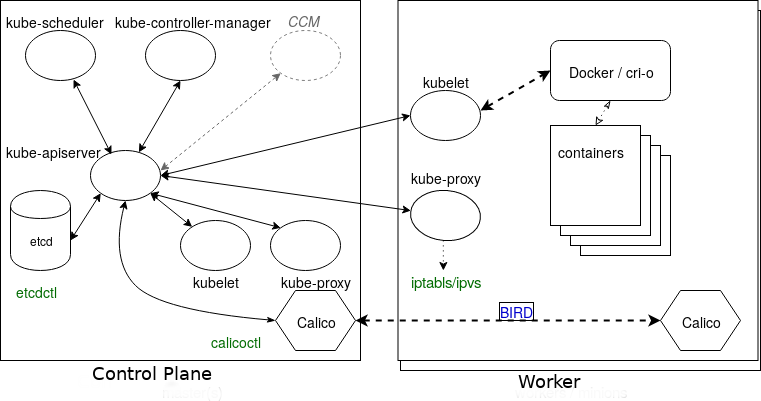

# Kubernetes fundamentals (LFS258)

## Table of contents:
- **[Basics of K8s](#basics-of-k8s)**
- **[APIs and Access](#apis-and-access)**

For information on how to configure your machine to follow along this guide please see the [Installation Guide](installation_guide.md).

## Basics of K8s

### Architecture

K8s consists of control plane (CP) and worker nodes, where CP runs an API service, scheduler, controllers, storage system to keep the state of the cluster, container settings, and networking configurations.
- `kubelet` - systemd process running on each node that accepts the API calls for Pod specification (aka. `PodSpec`) and will work to configure the local node until the specification has been met.
- `kube-apiserver` - API server serving REST operation and provides the frontend to the cluster's shared state through which all other components interact. API server validates and configures data for the API object which include pods, services, replication controllers etc.
- `kube-scheduler` - CP process that assigns pods to nodes determining which nodes are valid placements for each pod in the scheduling queue according to constraints and available resources. 
- `kube-proxy` - process running on every node, creates and manages networking rules to expose the container on the network to other containers or the outside world.
- `kube-controller-manager` - daemon control loop that watches the shared state of the cluster through the API server and makes changes attempting to move current state towards the desired state, e.g. replication controller, endpoint controller etc.
- `etcd` - database that stores the state of the cluster, and other persistent information in a b+tree key-value store. Instead of finding and changing an entry, values are always appended to the end and previous copies of the data are then marked for future removal by a compaction process.
- K8s provides a DNS pod and service that can be used to resolve DNS request to resolve pod and service names (DNS records are only created for Pods and Services).   


### Terminology

- **Namespaces** - a mechanism for isolating groups of resources within a single cluster. Names of resources need to be unique withing the namespace, but not across namespaces.
- **Label** - key:value pair used to organize and select groups of objects. Useful for filtering.
- **Annotations** - metadata that is not used by selector, but instead can be used by 3rd application or tools.
- **Node** - physical or virtual machine that serves as a worker in K8s. Each node is managed by CP and containers the services necessary to run pods.
- **Taints** - node configuration that allows to refuse pod assignments.
- **Toleration** - is a pod metadata that allows scheduler to schedule pods with matching taints.
- **Controllers**  - are watch-loops that monitor and modify the state of the cluster by interacting with the API server. Controllers are compiled into `kube-controller-manager`, however, other controllers may be added using custom resource definition.
  - _Informer_ - uses API server as a source to request the state of an object via an API call (received data is cached).
  - _SharedInformer_ - identical to _Informer_, with one difference - created cache is shared for multiple requests.
  - _Workqueue_ - uses a key to hand out tasks to various workers. The standard Go work queues of rate limiting, delayed, and time queue are typically used.
- **Workloads:**
  - **Pods** - are the smallest deployable units of computing that can be created and managed in K8s. Pod consists of one or more containers, with shared storage and network resources, and a specification for how to run the containers. Contents of the pod are always co-located and co-scheduled, and run in a shared context.
  - **Workload resources:**
      - **Deployments** - provides declarative updates for pods and replicaSets (serves as an abstraction over pods). Deployment controller changes the actual state to the specified desired state at a controlled rate.
      - **ReplicaSet** - maintains stable set of replica pods running at any given time. It's often used to guarantee the availability of a specified number of identical pods.
      - **StatefulSet** - similar to deployment it manages pods based on their spec, however, it maintains a sticky identity for each pod. StatefulSet provides guarantees about the ordering and uniqueness of the pods. (e.g. database deployment will be managed by statefulSets that would eliminate data inconsistencies)
      - **DaemonSet** - ensures that all (or some) nodes run a copy of a pod. Pods are added or garbage collected if node is added or removed from the cluster.
- **Services, Load balancing and networking:**
  - **Service** - abstraction that defines a logical set of pods and a policy by which to access them. It has two main functionalities (1) permanent IP address (static) that can be used instead of pod IP address, (2) load balancer. Because lifecycle of pod and service is not connected, if a pod dies, service will still remain active.
  - **Ingress** - an API object that manages external access to the services in a cluster (forwards external requests to internal services).
      
- **Storage:**
  - **Volumes** - abstraction serving as a data persistence for pods that attaches storage on local machine or outside the cluster.
- **Configuration:**
  - **ConfigMap** - non-confidential key-value pair configuration that is consumed by pods via env. variables, CLI arguments or configuration file in volume.
  - **Secrets** - similar to ConfigMap, however, they are specifically designed to hold sensitive data, such as passwords, tokens or keys.

### Components



### Single IP per Pod


The graphic shows a pod with two containers, A and B, and two data volumes, 1 and 2. Containers A and B share the network namespace of a third container, known as the pause container. The pause container is used to get an IP address, then all the containers in the pod will use its network namespace. To communicate with each other, containers within pods can use the loopback interface, write to files on a common filesystem, or via inter-process communication (IPC).

### Container to Outside Path


Even though there are two containers, they share the same namespace and the same IP address, which would be configured by kubectl working with kube-proxy. The IP address is assigned before the containers are started, and will be inserted into the containers. The container will have an interface like eth0@tun10. This IP is set for the life of the pod.

The endpoint is created at the same time as the service. Note that it uses the pod IP address, but also includes a port. The service connects network traffic from a node high-number port to the endpoint using iptables with ipvs on the way. The kube-controller-manager handles the watch loops to monitor the need for endpoints and services, as well as any updates or deletions.

### Services


This graphic shows a pod with a primary container, App, with an optional sidecar Logger. Also seen is the pause container, which is used by the cluster to reserve the IP address in the namespace prior to starting the other pods. This container is not seen from within Kubernetes, but can be seen using docker and crictl.

This graphic also shows a ClusterIP which is used to connect inside the cluster, not the IP of the cluster. As the graphic shows, this can be used to connect to a NodePort for outside the cluster, an IngressController or proxy, or another ”backend” pod or pods.

## APIs and Access 

Kunernetes entire architecture is build with powerful REST-based APIs, e.g. `kubectl` make API calls on your behalf (`kubectl` can be replaced with standard cURL or 3rd party program to interact with K8s).

### Access checking

The following `kubectl` command can be used to query current authorization for administrator or another user:
```bash
# check authorizations for current user
$> kubectl auth can-i create deployments
# check authorizations for another user in a namespace
$> kubectl auth can-i create deployments --as foo --namespace bar
```

There are currently three APIs which can be applied to set who and what can be queried:
- **SelfSubjectAccessReview** - Access review for any user, helpful for delegating to others. 
- **LocalSubjectAccessReview** - Review is restricted to a specific namespace.
- **SelfSubjectRulesReview** - A review which shows allowed actions for a user within a particular namespace. 

**Note:** The use of reconcile allows a check of authorization necessary to create an object from a file. No output indicates the creation would be allowed.

### Simple Pod

The bellow YAML file contains specifications for simple pod that will be deployed in your K8s cluster. Create a new file `simple-pod.yaml` and copy the content bellow.
```yaml
apiVersion: v1
kind: Pod
metadata:
    name: firstpod
spec:
    containers:
    - image: nginx
      name: stan 
```

Run the following commands:
```bash
# create a new pod
$> kubectl create -f simple-pod.yaml 
# check that pod was created 
$> kubectl get pods
# get pod object as YAML output
$> kubectl get pod simple-pod -o yaml
# delete our pod
$> kubectl delete pod simple-pod
```

### Namespaces

- `default` - namespace for keeping all resources, unless specified otherwise.
- `kube-node-lease` - namespace for keeping worker node lease information.
- `kube-public` - namespace that is available for everybody (including unauthenticated users), containing general information.
- `kube-system` - namespace containing infrastructural pods.

**Note:** If you would like to see all resource on the system you can run the following `kubectl get --all-namespaces pods` 
