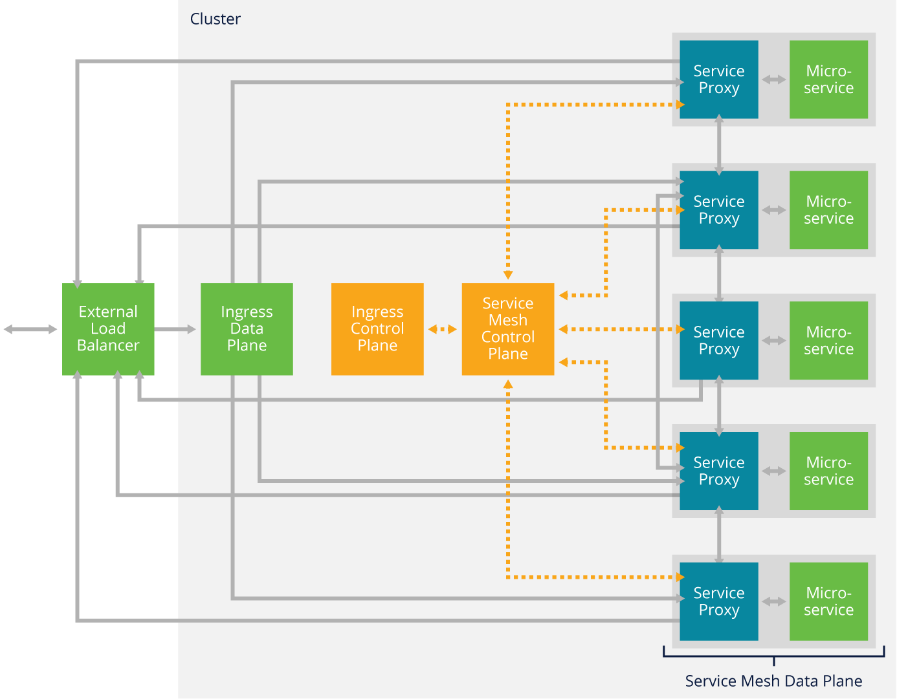

# Service mesh fundamentals (LFS243)

## Table of contents:

- **[Cloud-Native Apps](#cloud-native-apps)**
- **[Resilience for Distributed Systems](#resilience-for-distributed-systems)**
- **[Service Mesh Data Planes and Control Planes](#service-mesh-data-planes-and-control-planes)**
- **[When do you need a Service Mesh?](#when-do-you-need-a-service-mesh)**
- **[Service Mesh Interface (SMI)](#service-mesh-interface-smi)**

## Cloud-Native Apps

The cloud-native app architecture evolved in response to many of the common bottlenecks that slow down the development and release of monolithic applications, namely avoiding code “merge hell” that follows from a large number of engineers working around a single codebase, enabling independent release of individual services, and providing a limited area to investigate—a blast radius—when a component does fail. The cloud-native approach enables development and operational staff to rapidly make localized decisions related to their defined responsibilities and carry those decisions out.

DevOps workflows bring together software development and operations in order to enable faster, more frequent software releases that have a lower rate of failure, with the goal of achieving the principle of continuous delivery.

In common cloud-native app architectures, each cloud-native app is composed of a number of loosely-coupled and highly-cohesive microservices working together to form a distributed system. Loosely-coupled means that an individual microservice can be changed internally with minimal impact on any other microservices. Highly-cohesive microservices are built around a well-defined business context, and typically any modifications required are focused around a single area of responsibility or functionality.

Cloud-native applications are often packaged and run in containers. The underlying cloud infrastructure often runs on shared commodity hardware that is regularly changing, restarting, or failing. This means that a microservice should be designed to be ephemeral in nature. It should start up quickly, locate its dependent network services rapidly, and fail fast.

The below figure shows three diagrams, where (1) pie - is a monolithic, single-service app that is very common in legacy application, (2) cloud-native app with three microservices, and (3) cloud-native app with ten microservices showing, how big and complex the architecture could get.


## Resilience for Distributed Systems

In the context of a distributed system, resilience is about the distributed system being capable of automatically adapting when adverse situations occur in order to continue to serve its purpose.

The terms “availability” and “resilience” have different meanings. Availability is the percentage of time that a distributed system is up. Resilience is the use of strategies for improving a distributed system’s availability.

One of the primary goals of resilience is to prevent situations where an issue with one microservice instance causes more issues, which escalate and eventually lead to distributed system failure. This is known as a cascading failure.

An organization deploying a cloud-native app as a distributed system should consider resilience strategies at the network and/or application levels, such as:
- Load balancing
- Timeouts and automatic retries
- Deadline
- Circuit breakers

Resilience strategies could be implemented with (1) Libraries, or (2) Proxies.

#### Libraries

Implementing resilience strategies through application libraries can certainly be viable, but it doesn’t work for every situation. Resilience libraries are language-specific and microservice developers typically use the best language for each microservice, so a resilience library might not support all the necessary languages. In order to use the resilience library, developers might have to write some microservices in languages that provide less-than-desirable performance or have other significant shortcomings. 

Another concern is that relying on libraries means adding call wrappers to every susceptible call in every microservice. Some calls might be missed, some wrappers might contain errors—and having all the developers of all the microservices do things consistently is a challenge. There are also maintenance issues—every new developer who works on the microservices in the future will have to be aware of the call wrappers.

#### Proxies

Generally speaking, a proxy sits in the middle of communications between two parties and provides some sort of service for those communications. Proxies often provide some degree of separation between the two parties. For example, party A makes a request to party B, but that request actually goes from A to the proxy, which processes the request and sends its own request to B. A and B don’t directly communicate with each other.

In distributed systems, proxies can implement resilience strategies between the instances of microservices. To continue the previous example, when an instance of microservice A sends a request to microservice B, that request actually goes to a proxy. The proxy would process A’s request and decide which instance of microservice B it should go to, and then it would issue the request on A’s behalf.

The proxy would monitor for a reply from the B instance, and if the reply was not received in a timely manner, it could automatically retry the request with a different microservice B instance. In the figure, the proxy for microservice A has three instances of microservice B to choose from, and it selects the third one. If the third one does not respond quickly enough, the proxy can use the first or second instance instead.

The primary advantage of proxy-based resilience is that the individual microservices do not need to be modified to use special libraries; any microservices can be proxied.

### Load balancing

Load balancing refers to balancing the app’s requests amongst the running instances of the microservices. Load balancing assumes there’s more than one instance of each microservice; having multiple instances of each provides redundancy. Whenever feasible, the instances are distributed so if a particular server or even site goes down, not all instances of any microservice will become unavailable.

In OSI model, load balancing can be performed at layer 7 (application) and layer 4 (transport):
- Layer 4 (transport) - suppose that one network connection is sending a million requests per second to an app, and another network connection is sending one request per second to the same app. The load balancer is not aware of this difference; it simply sees two connections. If it sent the first connection to one microservice instance and the second connection to a second microservice instance, it would consider the load to be balanced.
- Layer 7 (application) - load balancer can see the requests within the connections and send each request to the optimal microservice instance, which can provide better balancing than a layer 4 load balancer can.

#### Algorithms

**Round Robin** - is the simplest algorithm. The instances of each microservice take turns handling requests. For example, if microservice A has three instances—1, 2, and 3—the first request would go to instance 1, the second to instance 2, and the third to instance 3. Once each microservice has received a request, the next request would be assigned to instance 1 to start another cycle through the instances.

**Least Request** - is a load balancing algorithm that distributes a new request to the microservice instance that has the fewest requests pending at the time. For example, suppose microservice B has four instances, and instances 1, 2, and 3 are each handling 10 requests right now but instance 4 is only handling two requests. With a least request algorithm, the next request would go to instance 4.

**Session Affinity** - also known as **sticky sessions**, is an algorithm that attempts to send all requests within a session to the same microservice instances. For example, if user Z is using an app and that causes a request to be sent to instance 1 of microservice C, then all other requests for microservice C in that same user session will be directed to instance 1.

### Timeouts and automatic retries

Timeouts are a fundamental concept for any distributed system. If one part of the system makes a request and another part fails to handle that request in a certain period of time, the request times out. The requester can then automatically retry the request with a redundant instance of the failed part of the system.

For microservices, timeouts are established and enforced between two microservices. If an instance of microservice A makes a request to an instance of microservice B and the microservice B instance doesn’t handle it in time, the request times out. The microservice A instance can then automatically retry the request with a different instance of microservice B.

There’s no guarantee that retrying a request after a timeout will succeed. For example, if all instances of microservice B have the same issue, a request to any of them might fail. But if only some instances are affected—for example, an outage at one data center—then the retry is likely to succeed.

Also, requests shouldn’t always be automatically retried. A common reason is to avoid accidentally duplicating a transaction that has already succeeded. Suppose that a request from microservice A to microservice B was successfully processed by B, but its reply to A was delayed or lost. It’s fine to reissue this request in some cases, but not in others.
- A safe transaction is one where the same request causes the same result. This is similar to a GET request in HTTP. A GET is a safe transaction because it retrieves data from a server but does not cause the data on the server to be altered. Reading the same data more than once is safe, so reissuing a request for a safe transaction should be fine. Safe transactions are also called idempotent transactions. 
- An unsafe transaction is one where the same request causes a different result. For example, in HTTP, POST and PUT requests are potentially unsafe transactions because they send data to a server. Duplicating a request could cause the server to receive that data more than once and potentially process it more than once. If the transaction is authorizing a payment or an order, you certainly don’t want to have it happen too many times.

### Deadlines

In addition to timeouts, distributed systems have what are called distributed timeouts or, more commonly, deadlines. These involve more than two parts of the system. Suppose there are four microservices that rely on each other: A sends a request to B, which processes it and sends its own request to C, which processes it and sends a request to D. The replies flow the other way, from D to C, C to B, and B to A.

The figure below depicts this scenario. Suppose that microservice A needs a reply to its request within 2.0 seconds. With a deadline, the time remaining to fulfill the request travels with the intermediate requests. This enables each microservice to prioritize the processing of each request it receives, and when it contacts the next microservice it will inform that microservice how much time is remaining.


### Circuit Breakers

Timeouts and deadlines address each request and reply within the distributed system individually. Circuit breakers have more of a “big picture” view of the distributed system. If a particular instance of a microservice is not replying to requests or is replying to them more slowly than expected, the circuit breaker can cause subsequent requests to be sent to other instances.

A circuit breaker works by setting a limit for the degree of service degradation or failures for a single instance of a microservice. When an instance exceeds that level, this trips the circuit breaker and causes the microservice instance to stop being used temporarily.

The goal of a circuit breaker is to prevent an issue with one microservice instance from negatively affecting other microservices and potentially causing a cascading failure. Once the issue has been resolved, the microservice instance can be used again.

Cascading failures often start because of automatic retries directed at microservice instances experiencing degradation or failure. Suppose you have a microservice instance that’s overwhelmed with requests, causing it to reply slowly. If a circuit breaker detects this and temporarily stops new requests from going to the instance, the instance has a chance to catch up on its requests and recover.

But if a circuit breaker doesn’t act and new requests keep going to the instance, that instance may completely fail. That forces all the requests to go to other instances. If those instances were already near capacity, the new requests may overwhelm them too and eventually cause them to fail. This cycle continues and eventually the entire distributed system fails.

## Service Mesh Data Planes and Control Planes

### Data Plane

In service mesh context, data plane is a group of proxies, each one dedicated to one of the app's services or microservices. Each proxy within the data plane is known as a service proxy (sometimes called a service mesh proxy). Service proxies are also commonly called sidecar proxies, because they are deployed and run out-of-process alongside a service or microservice, and the service or microservice doesn’t directly control the proxy.

The below figure shows a simplified example of a cloud-native app comprised of three microservices: A, B, and C. Each of those microservices has a corresponding service proxy, and each microservice only talks directly to its service proxy within its pod. This is shown by the blue arrows in the figure between the service proxies and the microservices.

The arrowheads indicate which entities can initiate communications; for the blue arrows, the double arrowheads mean that the service proxy can initiate communications to its microservice, and the microservice can initiate communications to its service proxy.

Each service proxy performs all communications with the other service proxies (and indirectly with their microservices) on behalf of its own microservice. These communications are typically in the form of remote procedure calls (RPCs). The red arrows in the figure depict this: communications between the service proxy for A and the service proxy for B, and between the service proxy for B and the service proxy for C.

Notice that there are also arrows originating with each service proxy and pointing outward, and that these arrows only go in one direction. These show that the service proxies have egress capabilities.

The orange arrows show that the service proxies can also accept incoming requests from elsewhere. A service proxy is actually both a proxy and a reverse proxy. We tend to think about proxies first and foremost as handling incoming requests destined for a particular app microservice. However, a service proxy also handles outgoing requests from its app’s microservice to the app’s other microservices. The first part—handling the incoming requests—is a proxy. The second part—handling the outgoing requests—is a reverse proxy.


#### Features

**Service discovery** - when a microservice needs to make a request of another microservice, the first microservice’s service proxy needs to find an instance of the second microservice that can handle the request. In some cases the instance also needs to have particular characteristics or attributes. In a dynamic, distributed system with large numbers of microservices, service discovery is a significant undertaking.

**Resilience** - these may include implementing any or all of the resilience strategies for traffic management, like load balancing, timeouts, deadlines, and circuit breakers, as well as others on behalf of the service proxy’s microservice. Resilience also includes verifying that the desired microservice instances are available and sending requests on behalf of the service proxy’s microservice to the right place.

**Observability** - a service proxy can observe each request and reply that it receives. It can also collect telemetry data, such as on the performance or health of its microservice. Most importantly, it can collect metrics about the traffic itself, such as throughput, latency, and failure rates. 

**Security** - a service proxy can identify requests and replies that violate policies and stop them from being passed through. Other security features service proxies may provide include authenticating the identity of other microservices and enforcing access control policies based on the authenticated identity.

### Control Plane 

A control plane manages and coordinates the data plane, which is all the service proxies for an app within a cluster, to form a distributed system. The control plane doesn’t directly observe or affect any service requests or replies; requests and replies don’t pass through the control plane.

A person defines policies and configures the control plane, and the control plane then takes care of configuring the data plane and monitoring its state and the states of the service proxies comprising it. The control plane makes sure every service proxy in the data plane follows the defined policies.

The control plane and the data plane it manages, when considered together, are an architectural pattern. A service mesh is one implementation of that pattern. The service mesh resides inside a cluster, handling the app’s service-to-service, east-west network traffic.

The below figure shows a simplified mesh, where the control plane interacts directly with each service proxy within the data plane. The orange dashed lines between the control plane and the service proxies indicate the control communications. The service proxies and their corresponding microservices form the data plane. For simplicity, this diagram only shows the control communications, and not any of the data communications.


### Ingress Controllers

The term “ingress” generally refers to network traffic coming into a network. In the context of Kubernetes, Ingress refers to the Ingress API object, which is responsible for routing and controlling inbound network traffic entering a Kubernetes cluster.

A pattern known as an Ingress controller performs this Ingress function in Kubernetes. The Ingress controller manages the app’s north-south traffic entering the cluster. Traffic from outside the cluster is sent to the Ingress controller, which routes the traffic to the appropriate services in the cluster.

Ingress controllers are also needed to route traffic into a service mesh when a service mesh is being used. The integration between an Ingress controller and a service mesh occurs at two levels:
- At the **_control plane_** level, the Ingress controller and service mesh need to share service discovery information so that traffic is consistently routed to the correct target destination.
- At the **_data plane_** level, the Ingress controller and service mesh share encryption secrets so that all communications can be secured.

Another pattern that can manage the north-south traffic entering a cluster is API Gateway that adds additional functionality on top of Ingress, such as rate limiting, authentication and API management capabilities.

#### Ingress Controllers and Service Mesh Control Plane

The below figure shows an example service mesh architecture including external load balancer, ingress data and control planes, and service mesh control and data planes.

The dotted lines represent control plane communications. As in the previous diagram, this figure shows control communications between the service mesh control plane and each of the service proxies in the data plane. This diagram also shows control communications between the control plane and the Ingress control plane. The service mesh control plane frequently updates the Ingress controller on the state of the microservices in its data plane. The Ingress controller uses that information to decide how to handle incoming requests entering the cluster from the external load balancer.



#### Ingress Controllers and Service Mesh Data Plane

The below figure shows the same service mesh example mentioned above, however, highlighting data plane communication. Suppose that a microservice outside the cluster generated a request destined for a microservice inside the cluster.
- In step 1, that request would reach the external load balancer from the outside world. Examples of external load balancers include cloud load balancers such as Amazon Elastic Load Balancers, Google HTTP(S) Load Balancers, and Azure Standard Load Balancers.
- The external load balancer would send that request into its cluster in step 2, to be received by the cluster’s Ingress data plane.
- The Ingress data plane would route the request to the service proxy in step 3.
- The service proxy would receive the request and contact its microservice to handle the request in step 4.
- The reply from the microservice would follow the same path out of the cluster to reach the microservice that generated the request. 


### Egress Requests

Egress, unlike Ingress, handles traffic that is routed from the cluster to an outside resource. Based on the figure above, this is the flow of the request generated by a microservice inside the cluster:
- In step 1, the microservice would send the request to its service proxy.
- In step 2, the service proxy would see that the request needed to go outside the cluster, so it would forward it out of the cluster to the external load balancer. The traffic does not go through the Ingress controller — the Ingress controller strictly handles Ingress requests, not egress requests.
- In step 3, the external load balancer would route the egress request on its path to the destination cluster.

## When do you need a Service Mesh? 

Not every cloud-native app requires a service mesh. Furthermore, in some scenarios service mesh can actually do more harm than good. Below are important factors to consider when deciding whether service mesh is the right solution for your app:

#### The number of microservices

If your app has a small number of microservices, the benefits of using a service mesh will be limited. Say that your app has two microservices. There’s not much a service mesh can do to improve resilience and observability from their existing states.

As the number of microservices in an app increases, the growing complexity of the app makes a service mesh more beneficial for supporting resilience, observability, and security among all the microservices and their interrelationships.

#### The microservice topology

This refers to the flows of the microservices being called and calling each other. In a shallow topology, there’s not much interaction directly between microservices; most requests come from outside the cluster. Service meshes usually don’t provide much value in shallow topologies because their primary purpose is to handle service-to-service requests.

In deeper microservice topologies, with many microservices sending requests to other microservices, which in turn send requests to other microservices, and so on, service meshes can be invaluable in having visibility into these requests, as well as securing the communications and adding resilience features to prevent cascading failures and other issues.

## Service Mesh Interface (SMI)

The goal of the SMI API is to provide a common, portable set of service mesh APIs which a Kubernetes user can use in a provider agnostic manner. In this way people can define applications that use service mesh technology without tightly binding to any specific implementation.”

### Traffic Specs API

The Traffic Specs API allows you to define routes that an app can use. The example bellow illustrates how a resource named `m-routes` can be defined using `HTTPRouteGroup` from the Traffic Specs API. It’s based on an example in the SMI specification. It will match on any HTTP GET request the app sees with the string `/metrics` in its path.

By itself, `HTTPRouteGroup` doesn’t do anything. It matches, but it doesn’t act on the match in any way. It’s meant to be used by other SMI APIs that do act. So, for example, the Traffic Split API could reference this group in one of its own resources, like declaring that traffic matching the `m-routes` definition should be split evenly between two versions of a particular microservice.

```yaml
kind: HTTPRouteGroup
metadata:
  name: m-routes
spec:
  matches:
  - name: metrics
    pathRegex: "/metrics"
    methods:
    - GET
```

### Traffic Split API

The Traffic Split API allows you to implement traffic splitting and traffic shifting methods like A/B testing, blue-green deployment, and canary deployment.

The below Yaml specification, is an example of 2 services `e8-widget-svc-current` and `e8-widget-svc-patch` that share a weight ratio 3:1 (defined in percentage 75% and 25%). Over time, to continue canary deployment, weight would shift from `e8-widget-svc-current` to `e8-widget-svc-patch` until it hits 100%.

```yaml
kind: TrafficSplit
metadata:
  name: e8-feature-test
  namespace: e8app
spec:
  service: e8-widget-svc
  backends:
  - service: e8-widget-svc-current
    weight: 75
  - service: e8-widget-svc-patch
    weight: 25
```

The above example, can be extended to include more versions of the same microservice, allowing the development team to test multiple features by shifting weight ratios.

### Traffic Access Control API

The Traffic Access Control API allows you to set access control policies for pod-to-pod (service proxy to service proxy) communications based on service proxy identity. When using Traffic Access Control API, by default all traffic is denied.

The `TrafficTarget` object uses three configuration options to grant traffic access:
- `sources` - specifies the pods that may be allowed as sources of the traffic
- `destination` - specified the pods that may be allowed as destination of the traffic
- `rules` - specified the characteristics that traffic should have to be allowed

The below Yaml specification defines rules for traffic being allowed from pods with `prometheus` service account to pods with `service-a` service account, when the traffic is being sent to port `8080`. The traffic is only allowed, when it matches the rules specified that in this case request should be HTTP GET on `/metrics` URL.

```yaml
kind: TrafficTarget
metadata:
  name: path-specific
  namespace: default
spec:
  destination:
    kind: ServiceAccount
    name: service-a
    namespace: default
    port: 8080
  rules:
  - kind: HTTPRouteGroup
    name: m-routes
    matches:
    - metrics
  sources:
  - kind: ServiceAccount
  name: prometheus
  namespace: default
```

### Traffic Metrics API

The Traffic Metrics API allows you to collect metrics on HTTP traffic and make those metrics available to other tools. Each metric involves a Kubernetes resource, either a lower-level one like a pod or a service, or a higher-level one like a namespace. Each metric is also limited to a particular edge, which is another term for the traffic’s source or destination. 

**Note:** An edge can be set as blank, which would match all traffic.

The `TrafficMetrics` object uses several configuration options:
- `resource` which specifies the source of the traffic to collect the metrics for.
- `edge`, which specifies the destination of the traffic to collect the metrics for.
- `timestamp`, which specifies when the definition was created.
- `window`, which specifies the time period to be used for calculating the metrics. In this example, 30 seconds is specified, so metrics will be calculated on the past 30 seconds of activity.
- `metrics`, which list the metrics to be collected. In this example, the metrics will include data on response latency and on successful and failed requests.

```yaml
kind: TrafficMetrics
# See ObjectReference v1 core for full spec
resource:
  name: foo-775b9cbd88-ntxsl
  namespace: foobar
  kind: Pod
edge:
  direction: to
  side: client
  resource:
    name: baz-577db7d977-lsk2q
    namespace: foobar
    kind: Pod
timestamp: 2019-04-08T22:25:55Z
window: 30s
metrics:
- name: p99_response_latency
  unit: seconds
  value: 10m
- name: p90_response_latency
  unit: seconds
  value: 10m
- name: p50_response_latency
  unit: seconds
  value: 10m
- name: success_count
  value: 100
- name: failure_count
  value: 100
```
